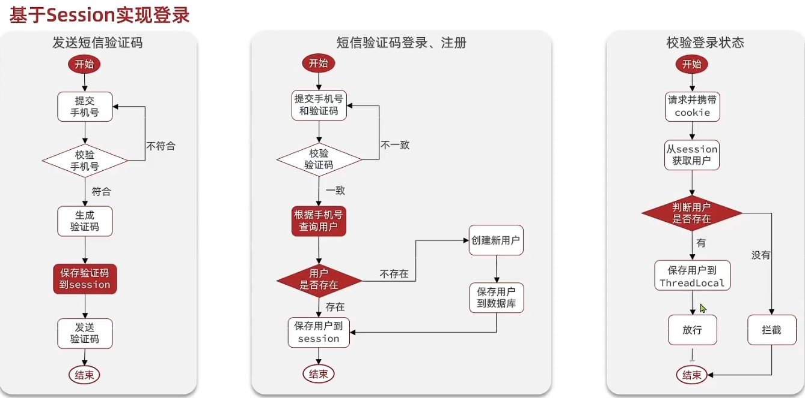

# 点评项目

Created: May 19, 2025 1:58 PM

## 1、基于session的登录实现

---



<aside>
💡

**在基于Session实现的登录功能，在登录成功后是不需要返回一个用户凭证的，因为Sesssion是基于cookie的，当客户端第一次访问系统时，系统的response就已经生成了一个sessionId放在cookie里面，保存在了客户端。后续的请求由于是把用户信息存储在了session中，每次请求时携带cookie中保存的sessionId就可以确定是哪个用户发起请求。**

</aside>


<aside>
💡

**这里登录验证功能使用拦截器来实现，在访问对应接口之前取出session中对应的user信息，存储到threadLocal中，提供给后续的操作使用。**

</aside>

## 2、集群的Session共享问题

---


## 3、基于Redis实现共享session登录

---


**Redis代替session需要考虑的问题：**

- **选择合适的数据结构**
- **选择合适的key**
- **选择合适的存储粒度**

<aside>
💡

</aside>

<aside>
💡

**由于拦截器访问的都是需要登录的路径，所以会在每次访问时刷新token过期时间，若用户在登陆后，一直访问不需要登录的api，拦截器不生效，token的过期时间就不会被刷新，直到过期。
此时，可以在拦截需要登录请求的拦截器前面加一个拦截所有请求的拦截器。**

</aside>


```java
package com.zhang.utils;

import cn.hutool.core.bean.BeanUtil;
import cn.hutool.core.util.StrUtil;
import com.zhang.dto.UserDTO;
import org.springframework.data.redis.core.StringRedisTemplate;
import org.springframework.web.servlet.HandlerInterceptor;

import javax.servlet.http.HttpServletRequest;
import javax.servlet.http.HttpServletResponse;
import java.util.Map;
import java.util.concurrent.TimeUnit;

public class RefreshTokenInterceptor implements HandlerInterceptor {
    private StringRedisTemplate stringRedisTemplate;

    public RefreshTokenInterceptor(StringRedisTemplate stringRedisTemplate) {
        this.stringRedisTemplate = stringRedisTemplate;
    }

    @Override
    public boolean preHandle(HttpServletRequest request, HttpServletResponse response, Object handler) throws Exception {
        // 从请求头中获取token
        String token = request.getHeader("authorization");
        if (StrUtil.isBlank(token)) {
            return true;
        }

        String tokenKey = RedisConstants.LOGIN_USER_KEY + token;
        // 基于token获取redis中的与用户
        Map<Object, Object> userMap = stringRedisTemplate.opsForHash().entries(tokenKey);

        if (userMap.isEmpty()) {
            return true;
        }
        UserDTO userDTO = BeanUtil.fillBeanWithMap(userMap, new UserDTO(), false);
        UserHolder.saveUser(userDTO);
        // 刷新token有效期
        stringRedisTemplate.expire(tokenKey, RedisConstants.LOGIN_USER_TTL, TimeUnit.MINUTES);
        return true;
    }
}

```

```java
package com.zhang.utils;

import org.springframework.web.servlet.HandlerInterceptor;
import javax.servlet.http.HttpServletRequest;
import javax.servlet.http.HttpServletResponse;

public class LoginInterceptor implements HandlerInterceptor {

    @Override
    public boolean preHandle(HttpServletRequest request, HttpServletResponse response, Object handler) throws Exception {
        // 判断是否需要拦截（ThreadLocal中是否有用户）
        if (UserHolder.getUser() == null) {
            // 没有，拦截，设置状态码
            response.setStatus(401);
            // 拦截
            return false;
        }
        // 有用户则放行
        return true;
    }

    @Override
    public void afterCompletion(HttpServletRequest request, HttpServletResponse response, Object handler, Exception ex) throws Exception {
        UserHolder.removeUser();
    }
}
```

**这里RefreshTokenInterceptor 拦截器会拦截所有的请求（这个拦截器无论有没有登录都会被放行），如果请求中携带有token则从redis中取出用户数据放入ThreadLocal中供后续使用，刷新toekn有效期然后放行。如果没有携带token直接放行进入到（如果你访问的url不需要登录，则不会进入到这个拦截器）LoginInterceptor，在这个拦截器中会判断ThreadLocal中是否有user，如果没有直接拦截，有则放行。**

## 4、缓存

---


## 5、给商户信息添加到缓存

---


## 6 、缓存更新策略

---


### 6.1、主动更新策略

---


## 7、给查询商铺的缓存添加超时剔除和主动更新的策略

---

```java
@Service
public class ShopServiceImpl extends ServiceImpl<ShopMapper, Shop> implements IShopService {

    @Resource
    private StringRedisTemplate stringRedisTemplate;

    @Override
    public Result queryById(Long id) {
        String key = RedisConstants.CACHE_SHOP_KEY + id;
        // 1.从redis中查询商铺缓存
        String shopJson = stringRedisTemplate.opsForValue().get(key);
        // 2.判断是否存在
        if (StrUtil.isNotBlank(shopJson)) {
            // 存在直接返回
            Shop shop = JSONUtil.toBean(shopJson, Shop.class);
            return Result.ok(shop);
        }
        // 不存在从数据库中查询
        Shop shop = getById(id);
        if (shop == null) {
            return Result.fail("店铺不存在!");
        }

        stringRedisTemplate.opsForValue().set(key, JSONUtil.toJsonStr(shop), RedisConstants.CACHE_SHOP_TTL, TimeUnit.MINUTES);
        return Result.ok(shop);
    }

    @Override
    @Transactional
    public Result update(Shop shop) {
        Long id = shop.getId();
        if (id == null) {
            return Result.fail("店铺id不能为空!");
        }
        updateById(shop);
        stringRedisTemplate.delete(RedisConstants.CACHE_SHOP_KEY + shop.getId());
        return Result.ok();
    }
}

```

## 8、缓存穿透

---


### 8.1、解决查询商铺时的缓存穿透问题

---


```java
    @Override
    public Result queryById(Long id) {
        String key = RedisConstants.CACHE_SHOP_KEY + id;
        // 1.从redis中查询商铺缓存
        String shopJson = stringRedisTemplate.opsForValue().get(key);
        // 2.判断是否存在
        if (StrUtil.isNotBlank(shopJson)) {
            // 存在直接返回
            Shop shop = JSONUtil.toBean(shopJson, Shop.class);
            return Result.ok(shop);
        }
        // 判断命中的是否是空值
        if (shopJson != null) { // 或者 shopJson == ""
            return Result.fail("店铺信息不存在! ");
        }

        // 不存在从数据库中查询
        Shop shop = getById(id);
        if (shop == null) {
            // 将空值写入Redis ,解决缓存穿透问题
            stringRedisTemplate.opsForValue().set(key, "", RedisConstants.CACHE_NULL_TTL, TimeUnit.MINUTES);
            // 返回错误信息
            return Result.fail("店铺不存在!");
        }

        stringRedisTemplate.opsForValue().set(key, JSONUtil.toJsonStr(shop), RedisConstants.CACHE_SHOP_TTL, TimeUnit.MINUTES);
        return Result.ok(shop);
    }
```


## 9、缓存雪崩

---


## 10、缓存击穿

---


<aside>
💡

**这两种方案都是在解决缓存在重建期间内的并发问题。互斥锁的解决方案是在缓存重建的这段时间内让这些并发的线程串行执行或者互相等待从而确保安全，此方案确保了数据的一致性，牺牲了服务的可用性。性能会有很大下降，而且在阻塞过程中可能甚至于不可用
逻辑过期方案，是在缓存重建期间内保证了可用性，所有请求都可以访问，只不过访问得到的可能是旧的数据，与数据库不一致，牺牲了一致性。**

</aside>

### 10.1、基于互斥锁方式解决缓存击穿问题

---


```java
    // 查询商铺缓存击穿方案解决
    public Shop queryWithMutex(Long id) {
        String key = RedisConstants.CACHE_SHOP_KEY + id;
        // 1.从redis中查询商铺缓存
        String shopJson = stringRedisTemplate.opsForValue().get(key);
        Shop shop;
        // 2.判断是否存在
        if (StrUtil.isNotBlank(shopJson)) {
            // 存在直接返回
            shop = JSONUtil.toBean(shopJson, Shop.class);
            return shop;
        }
        // 判断命中的是否是空值
        if (shopJson != null) { // 或者 shopJson == ""
            return null;
        }
        // 4.实现缓存重建
        // 4.1 获取互斥锁
        String lockKey = RedisConstants.LOCK_SHOP_KEY + id;
        try {
            boolean isLock = tryLock(lockKey);
            // 4.2 判断是否获取成功
            if (!isLock) {
                // 4.3 失败,则休眠并重试
                Thread.sleep(50);
                // 这里也可以改为 while循环+重试次数机制
                return queryWithMutex(id);

            }
            // 再次检查缓存，防止缓存在等待锁期间被其他线程重建存在直接返回
            shopJson = stringRedisTemplate.opsForValue().get(key);
            if (StrUtil.isNotBlank(shopJson)) {
                shop = JSONUtil.toBean(shopJson, Shop.class);
                return shop;
            }
            if (shopJson != null) { // 或者 shopJson == ""
                return null;
            }

            // 4.4 成功,根据id  查询数据库
            shop = getById(id);
            // 模拟重建延时
            Thread.sleep(200);
            // 库中不存在
            if (shop == null) {
                // 将空值写入Redis ,解决缓存穿透问题
                stringRedisTemplate.opsForValue().set(key, "", RedisConstants.CACHE_NULL_TTL, TimeUnit.MINUTES);
                // 返回错误信息
                return null;
            }
            stringRedisTemplate.opsForValue().set(key, JSONUtil.toJsonStr(shop), RedisConstants.CACHE_SHOP_TTL, TimeUnit.MINUTES);
        } catch (InterruptedException e) {
            throw new RuntimeException(e);
        } finally {
            // 释放互斥锁
            unLock(lockKey);
        }
        return shop;
    }
```

```java
    private boolean tryLock(String key) {
        Boolean isLock = stringRedisTemplate.opsForValue().setIfAbsent(key, "1", 10, TimeUnit.SECONDS);
        return BooleanUtil.isTrue(isLock);
    }

    private void unLock(String key) {
        stringRedisTemplate.delete(key);
    }
```

**为什么在获取互斥锁之后，还要再次判断 Redis 中是否存在 `shop` 信息？**

这是一个典型的"双重检查”机制（Double Check）**，主要是为了防止缓存击穿时发生“重复重建缓存”的问题**。下面详细解释一下：

✅ **问题背景：缓存击穿**

当某个热点数据在 Redis 中刚好过期，而这时候有大量请求同时查询这个数据时：

- 所有请求发现缓存中没有数据，于是**同时去请求数据库**；
- 会对数据库造成**巨大的压力**（这就是“缓存击穿”）；

---

🔒 **使用互斥锁的目的**

为了解决缓存击穿的问题，程序引入了互斥锁（`tryLock`）：

- 第一个线程获取锁，开始查数据库、重建缓存；
- 其他线程获取锁失败，就等待后重试（或直接返回）；

---

❓ **那为什么获取锁后还要再次查 Redis？**

这是关键点：

> 因为在当前线程等待锁的过程中，有可能：
>
>
> **别的线程已经完成了数据库查询，并把数据写回 Redis 了。**
>

所以，在**当前线程获取锁成功后，应该再次检查 Redis**，以免重复查数据库、重复写缓存。

---

📌 举个例子

假设有两个线程 A 和 B：

1. A、B 同时请求 id=1 的店铺；
2. Redis 中没有缓存；
3. A 获得锁，B 失败等待；
4. A 查数据库，写入 Redis；
5. 此时 B 获取锁成功；
6. 如果 B **不检查 Redis**，它会再次查数据库、再写 Redis；
7. 出现**重复查询 + 重建缓存**的情况；

所以 **B 获取锁后，也要再查一次 Redis**，如果 A 已经写好了，就直接返回了，避免重复操作。

---

**✅ 总结一句话：**

> **这是为了防止多个线程重复查询数据库、重复重建缓存，确保只有一个线程执行数据库查询，其他线程复用已经写入的缓存数据。**
>

这是缓存重建场景中非常经典且推荐的实践方式。

---

✅ 1. **锁实现建议封装超时 + 自动续期机制（推荐用 Redisson）**

你使用了 `tryLock(lockKey)` 和 `unLock(lockKey)` 方法，推测你是用 `SETNX + expire` 自己实现的锁。

建议使用成熟的分布式锁实现，比如 **Redisson**，它支持：

- 自动续期；
- 避免死锁（线程挂掉后能释放锁）；
- 内置看门狗机制；

❗️**风险：自己实现锁时如果线程异常退出，锁得不到释放，可能导致死锁。**

---

🔁 2. **递归重试建议替换为循环重试（避免堆栈溢出）**

你的代码中使用了递归方式重试：

```java
return queryWithMutex(id);
```

这在并发高或缓存重建耗时长时，可能出现**栈溢出（StackOverflowError）**。

**✅ 改进建议：用 `while(true)` 循环 + 重试次数限制：**

```java
int retryCount = 0;
while (retryCount < MAX_RETRY) {
    boolean isLock = tryLock(lockKey);
    if (isLock) break;
    Thread.sleep(50);
    retryCount++;
}
if (retryCount == MAX_RETRY) {
    // 返回一个错误结果或降级逻辑
}
```

---

🛠️ 3. **缓存空值建议使用统一对象，而非 `""` 空字符串**

当前你将空值写入 Redis 的方式为：

```java
stringRedisTemplate.opsForValue().set(key, "", ...);
```

这种写法不如写入一个结构化的“空对象”安全，比如：

```json
{"id":null,"name":null,...}
```

或者可以定义一个状态标识，比如：

```json
{"isNull": true}
```

这样读取时更容易统一处理。

---

📦 4. **缓存时间应支持随机因子，防止雪崩**

当前写入 Redis 的 TTL 是固定值 `RedisConstants.CACHE_SHOP_TTL`，这容易造成**缓存雪崩**（大批 key 同时过期）。

**✅ 改进建议：加随机时间防止同时过期**

```java
long ttl = RedisConstants.CACHE_SHOP_TTL + RandomUtil.randomInt(5); // 加随机偏移
stringRedisTemplate.opsForValue().set(key, json, ttl, TimeUnit.MINUTES);
```

---

**📚 5. 代码结构可以进一步封装和模块化**

当前所有逻辑都写在一个方法中，建议将以下功能提取为独立方法或类，增强可维护性：

| 功能 | 封装建议 |
| --- | --- |
| 获取/释放锁 | 封装为 LockUtils 类 |
| 查询 Redis 缓存 | 封装为 CacheClient 工具类 |
| 判断空值缓存 | 抽出成方法 `isCacheHitButEmpty()` |
| 睡眠重试逻辑 | 封装成 `retryWithBackoff()` 方法 |

---

🔐6. **锁释放要加判断：只释放自己加的锁**

如果你是用 `SETNX` 实现的锁，释放锁时应该加 UUID 判断（确保不会误删别人加的锁）：

```java
// 加锁时保存UUID
stringRedisTemplate.opsForValue().set(lockKey, uuid, ...);

// 解锁前判断
if (uuid.equals(stringRedisTemplate.opsForValue().get(lockKey))) {
    stringRedisTemplate.delete(lockKey);
}
```

**否则在某些极端场景下可能会释放别人的锁。**

**🚨 场景举例：误删其他线程的锁**

1. 线程 A 加锁成功，设置 `lockKey -> A_UUID`，锁有效期 10 秒；
2. A 处理任务中……但任务耗时太长，锁**过期自动释放**；
3. 此时线程 B 加锁成功，设置 `lockKey -> B_UUID`；
4. 线程 A 执行完毕，调用 `delete(lockKey)`，直接把线程 B 的锁删了！

   这就是**“误删他人锁”**，可能引发并发安全问题。


### 10.2、基于逻辑过期的方式解决缓存击穿问题

---


```java
@Service
public class ShopServiceImpl extends ServiceImpl<ShopMapper, Shop> implements IShopService {

    @Resource
    private StringRedisTemplate stringRedisTemplate;

    @Override
    public Result queryById(Long id) {
        // 解决缓存穿透
        // Shop shop = queryWithPassThrough(id);

        // 互斥锁解决缓存击穿
        // Shop shop = queryWithMutex(id);

        // 逻辑过期解决缓存击穿
        Shop shop = queryWithLogicalExpire(id);
        if (shop == null) {
            return Result.fail("店铺不存在");
        }
        return Result.ok(shop);
    }

    private static final ExecutorService CACHE_REBUILD_EXECUTOR = Executors.newFixedThreadPool(10);

    // 查询商铺缓存穿透方案解决
    public Shop queryWithLogicalExpire(Long id) {
        String key = RedisConstants.CACHE_SHOP_KEY + id;
        // 1.从redis中查询商铺缓存
        String shopJson = stringRedisTemplate.opsForValue().get(key);
        // 2.判断是否存在
        if (StrUtil.isBlank(shopJson)) {
            return null;
        }
        RedisData redisData = JSONUtil.toBean(shopJson, RedisData.class);
        Shop shop = JSONUtil.toBean((JSONObject) redisData.getData(), Shop.class);
        LocalDateTime expireTime = redisData.getExpireTime();
        // 判断是否过期
        if (expireTime.isAfter(LocalDateTime.now())) {
            // 未过期直接返回店铺信息
            return shop;
        }
        // 已过期，需要重建缓存
        // 缓存重建
        // 获取互斥锁
        String lockKey = RedisConstants.LOCK_SHOP_KEY + id;
        boolean isLock = tryLock(lockKey);
        // 判断是否获取锁成功
        if (isLock) {
            // 成功，开启独立线程进行缓存重建
            CACHE_REBUILD_EXECUTOR.submit(() -> {
                try {
                    // 重建缓存
                    this.saveShop2Redis(id, 20L);
                } catch (Exception e) {
                    throw new RuntimeException(e);
                } finally {
                    // 释放锁
                    unLock(lockKey);
                }
            });
        }
        return shop;
    }

    private boolean tryLock(String key) {
        Boolean isLock = stringRedisTemplate.opsForValue().setIfAbsent(key, "1", 10, TimeUnit.SECONDS);
        return BooleanUtil.isTrue(isLock);
    }

    private void unLock(String key) {
        stringRedisTemplate.delete(key);
    }

    public void saveShop2Redis(Long id, Long expireSeconds) throws InterruptedException {
        // 查询店铺数据
        Shop shop = getById(id);
        // 模拟延时
        // Thread.sleep(20);
        RedisData redisData = new RedisData();
        redisData.setData(shop);
        redisData.setExpireTime(LocalDateTime.now().plusSeconds(expireSeconds));
        // 写入Redis
        stringRedisTemplate.opsForValue().set(RedisConstants.CACHE_SHOP_KEY + id, JSONUtil.toJsonStr(redisData));
    }
}
```

**这段代码的设计目标：逻辑过期 + 异步缓存重建**

即：

- **先查 Redis**，拿到缓存数据结构 `RedisData`（包含真实数据和逻辑过期时间）；
- 如果数据未过期：直接返回；
- 如果数据过期：**仍然返回旧数据**，**同时后台线程异步刷新缓存**；
- 这样可以**避免请求穿透数据库（缓存击穿）**。

---

**当获取锁更新完缓存后，返回的shop为旧数据。为什么“返回旧数据”是合理的？**

1. **提升系统可用性**：
    - 如果不返回旧数据，用户请求就得等数据库查新数据再写入 Redis —— 这就和直接查数据库差不多了；
    - 返回旧数据，用户体验更流畅（大多数业务允许轻度的数据时延，比如商铺名称更新延迟几秒无妨）。
2. **异步刷新缓存避免并发击穿**：
    - 多个线程遇到过期数据时，只有一个线程拿到锁刷新缓存；
    - 其他线程返回旧数据，不会并发打到数据库。

**这里没有在获取锁后做一个双重检查，可能会导致缓存被更新多次，这里解释一下为什么需要加锁后再次检查？**
因为：

- 第一次检查时可能多个线程几乎同时发现缓存过期；
- 然后多个线程进入加锁等待队列；
- 第一个线程成功更新缓存后，**其他线程依然会执行加锁之后的逻辑**；
- 如果你**不在加锁后重新检查一次**，这些线程又会重复查询数据库并覆盖缓存。

**这里做一个压测**


**正常更新缓存的话只会执行一次SQL，在并发测试下，可以看到缓存被更新了两次**


**代码优化：在获取完锁之后，再做一次检查。**

```java
@Service
public class ShopServiceImpl extends ServiceImpl<ShopMapper, Shop> implements IShopService {

    @Resource
    private StringRedisTemplate stringRedisTemplate;

    @Override
    public Result queryById(Long id) {
        // 解决缓存穿透
        // Shop shop = queryWithPassThrough(id);

        // 互斥锁解决缓存击穿
        // Shop shop = queryWithMutex(id);

        // 逻辑过期解决缓存击穿
        Shop shop = queryWithLogicalExpire(id);
        if (shop == null) {
            return Result.fail("店铺不存在");
        }
        return Result.ok(shop);
    }

    private static final ExecutorService CACHE_REBUILD_EXECUTOR = Executors.newFixedThreadPool(10);

    // 查询商铺缓存穿透方案解决
    public Shop queryWithLogicalExpire(Long id) {
        String key = RedisConstants.CACHE_SHOP_KEY + id;
        // 1.从redis中查询商铺缓存
        String shopJson = stringRedisTemplate.opsForValue().get(key);
        // 2.判断是否存在
        if (StrUtil.isBlank(shopJson)) {
            return null;
        }
        RedisData redisData = JSONUtil.toBean(shopJson, RedisData.class);
        Shop shop = JSONUtil.toBean((JSONObject) redisData.getData(), Shop.class);
        LocalDateTime expireTime = redisData.getExpireTime();
        // 判断是否过期
        if (expireTime.isAfter(LocalDateTime.now())) {
            // 未过期直接返回店铺信息
            return shop;
        }
        // 已过期，需要重建缓存
        // 缓存重建
        // 获取互斥锁
        String lockKey = RedisConstants.LOCK_SHOP_KEY + id;
        boolean isLock = tryLock(lockKey);
        // 判断是否获取锁成功
        if (isLock) {
            // 双重检查shop数据是否被更新
            shopJson = stringRedisTemplate.opsForValue().get(key);
            if (StrUtil.isBlank(shopJson)) {
                return null;
            }
            redisData = JSONUtil.toBean(shopJson, RedisData.class);
            shop = JSONUtil.toBean((JSONObject) redisData.getData(), Shop.class);
            expireTime = redisData.getExpireTime();
            if (expireTime.isAfter(LocalDateTime.now())) {
                return shop;
            }
            // 成功，开启独立线程进行缓存重建
            CACHE_REBUILD_EXECUTOR.submit(() -> {
                try {
                    // 重建缓存
                    this.saveShop2Redis(id, 20L);
                } catch (Exception e) {
                    throw new RuntimeException(e);
                } finally {
                    // 释放锁
                    unLock(lockKey);
                }
            });
        }
        return shop;
    }

    private boolean tryLock(String key) {
        Boolean isLock = stringRedisTemplate.opsForValue().setIfAbsent(key, "1", 10, TimeUnit.SECONDS);
        return BooleanUtil.isTrue(isLock);
    }

    private void unLock(String key) {
        stringRedisTemplate.delete(key);
    }

    public void saveShop2Redis(Long id, Long expireSeconds) throws InterruptedException {
        // 查询店铺数据
        Shop shop = getById(id);
        // 模拟延时
        // Thread.sleep(20);
        RedisData redisData = new RedisData();
        redisData.setData(shop);
        redisData.setExpireTime(LocalDateTime.now().plusSeconds(expireSeconds));
        // 写入Redis
        stringRedisTemplate.opsForValue().set(RedisConstants.CACHE_SHOP_KEY + id, JSONUtil.toJsonStr(redisData));
    }
}
```

**使用上面的配置再次进行压测，可以看到，查询数据库的操作只执行了一次。**

